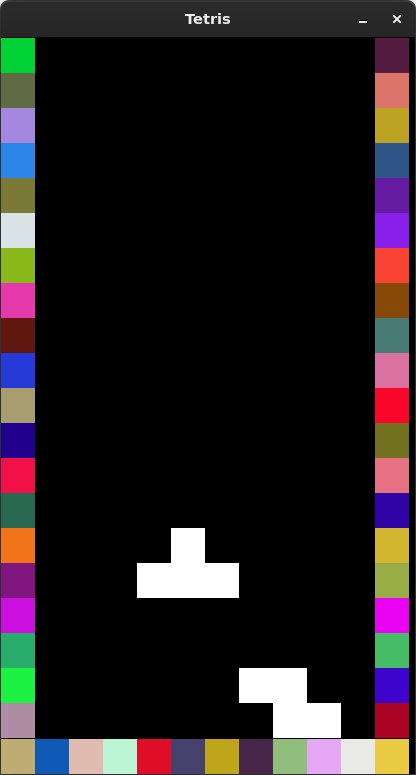

# Tetris

This project serves only to fulfill my curiosity about pygame.



## What's missing

- Scoring is not implemented
- Immediately place the piece on key press

## Running and Installation

The usage of a virtual environment is recommended.
```bash
python3 -m venv venv
source venv/bin/activate
pip install -r requirements.txt
python3 main.py
```

## License

[MIT](https://choosealicense.com/licenses/mit/)